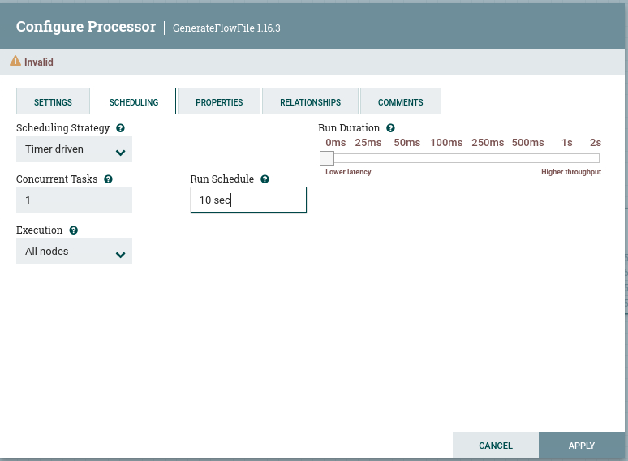
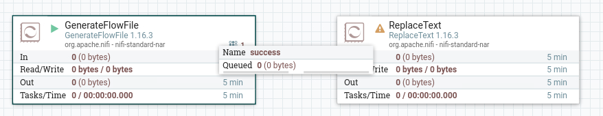

# Lab 03
## Data Generator

* Create a processor that generates data

* Create a processor that reads data
* Look for GenerateFlowFile

* Add the GenerateFlowFile processor to the flow
* It will have a warning - that's OK, it is not configured yet

* Let's configure the processor

* Let's go to the properties tab

* Analyze and explain each of the properties

* Let's set the properties
* File size - 1B
* Batch size - 5
* We don't want unique FlowFiles

* Now let's go to Schedule tab

* Pay attention to the run schedule
* This is how often the processor will run

* This means that the processor will run every 10 seconds and create 5 FlorFiles

* Now, add another Processor and configure it as ReplaceText

* Connect the two processors

* For relationship success

* And now, start the first processor, the GenerateFlowFile processor

* Watch how more and more bytes are queued up

* Stop the first processor and let us configure the second processor

* Configure the ReplaceText processor to replace the text with "Hello world"

* That's it! You get as much test data as you want!!

### Congratulations!

